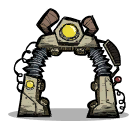

# Super POD



Mod tùy chỉnh **Printing Pod** cho Oxygen Not Included — thay đổi thời gian spawn, số lượng duplicant/care package, traits, interests, stress/overjoyed reactions.

Tương thích với ONI build **719533+** (March 2026 update), hỗ trợ tất cả DLC.

## Tính năng

- Tùy chỉnh thời gian spawn (mặc định game: 1800s/cycle)
- Thay đổi số lượng duplicant và care package hiển thị (tổng ≤ 10)
- Cấu hình số interest và giá trị interest
- Cấu hình số positive/negative traits
- Chọn stress reaction và overjoyed response
- Nút "Reject All" → "Shuffle" (re-roll thay vì reject)
- Hot-reload config — sửa `config.ini` không cần restart game

## Cài đặt

### Steam Workshop

[Super POD trên Steam Workshop](https://steamcommunity.com/sharedfiles/filedetails/?id=2753303517)

### Cài thủ công

1. Tải từ [Releases](https://github.com/sant1ago-da-hanoi/oni-super-pod/releases)
2. Giải nén vào thư mục local mod:
   ```
   # macOS
   ~/Library/Application Support/unity.Klei.Oxygen Not Included/mods/Local/SuperPOD/

   # Windows
   %USERPROFILE%\Documents\Klei\OxygenNotIncluded\mods\Local\SuperPOD\
   ```
   Cấu trúc:
   ```
   SuperPOD/
   ├── SuperPOD.dll
   ├── mod_info.yaml
   ├── mod.yaml
   ├── preview.png
   └── Config/
       └── config.ini
   ```
3. Mở game → **Mods** → bật **Super POD** → khởi động lại

## Cấu hình

File `Config/config.ini`:

| Field | Mô tả | Mặc định | Giới hạn |
|-------|--------|----------|----------|
| `TimeBeforeSpawn` | Thời gian spawn (giây/cycle) | 900 | > 0 |
| `DuplicantNumber` | Số duplicant hiển thị | 3 | 0–10 |
| `CarePackageNumber` | Số care package hiển thị | 1 | 0–10 |
| `InterestNumber` | Số interest | 2 | 0–13 |
| `InterestValue` | Giá trị interest | 25 | 0–1000 |
| `PositiveTraitsNumber` | Số good traits | 3 | 0–34 |
| `NegativeTraitsNumber` | Số bad traits | 0 | 0–28 |
| `Stress` | Danh sách stress reaction (random chọn 1) | Aggressive,StressVomiter,UglyCrier,BingeEater | |
| `Overjoyed` | Danh sách overjoyed response (random chọn 1) | BalloonArtist,SparkleStreaker,StickerBomber,SuperProductive | |

> `DuplicantNumber + CarePackageNumber` phải ≤ 10.

## Build

Yêu cầu:
- .NET SDK 6.0+
- Oxygen Not Included đã cài qua Steam

```bash
dotnet build SuperPOD.csproj
```

Output: `bin/Debug/netstandard2.1/SuperPOD.dll`

Custom game path:
```bash
dotnet build SuperPOD.csproj -p:ONIManagedDir="/path/to/OxygenNotIncluded_Data/Managed"
```

## License

MIT
